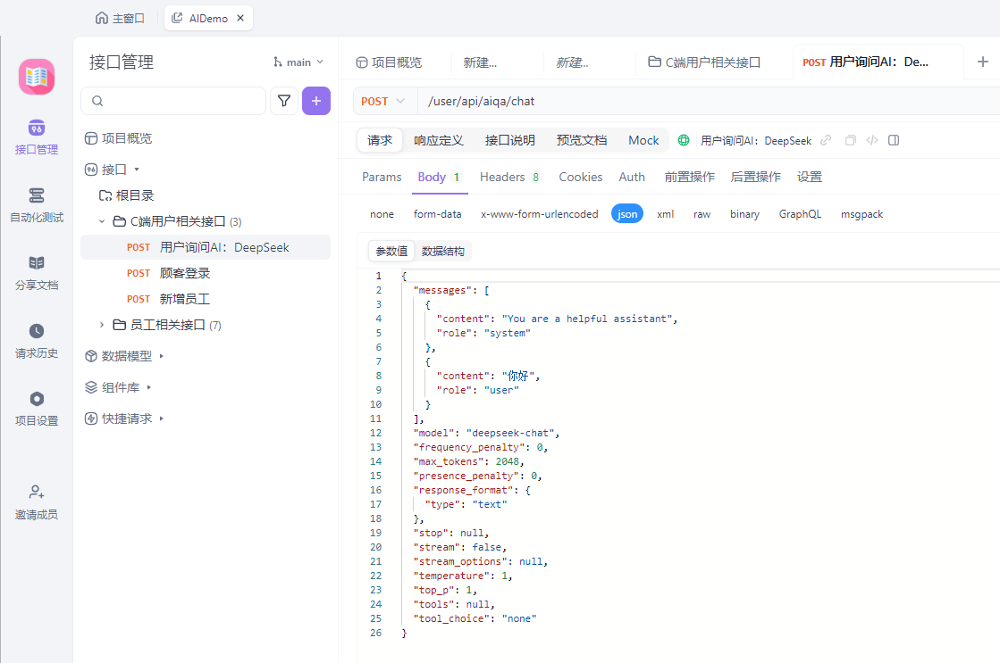
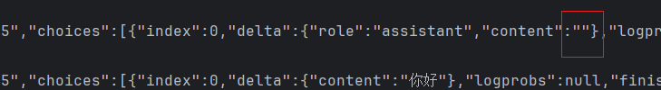
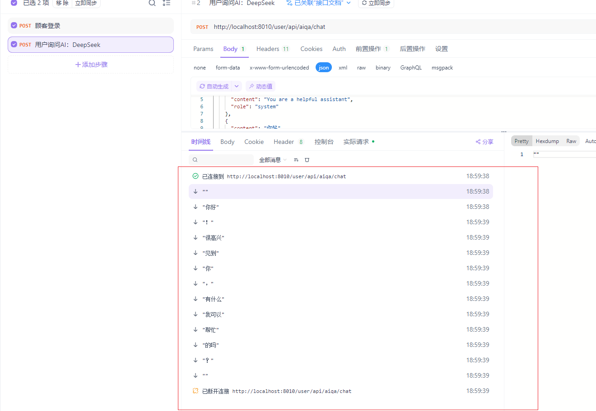

# AI-Demo

# 这是一个模版

这是我基于苍穹外卖项目浓缩出的一个框架为`SpringBoost2`+`Mybatis2` 的模版。

该模版具有苍穹外卖的各项基础功能，包括但不限于 拦截器+JWT，全局异常处理器，AOP等等。

该模版是用户端+管理员（员工端）。

我在这个模版的基础上，给用户端添加了AI相关功能

- 调用了DeepSeek提供的API，由此实现了AI问答功能。
- 待补充


# 调试过程

利用Knife4j框架结合Apifox，可以实现接口文档的自动更新和自动化测试，效果如下：

## 接口文档自动更新



## 自动化测试：


## 流式响应的测试
事实上，给DeepSeek-R1发送请求时，得到的第一个数据块和倒数第二个数据块中的都是有空值。
以及每个卷之后都会有个空字符串`""`，所以处理时需要注意


流式响应添加成功，通过Apifox测试可以得知：

所以前端只需要逐步调用之后再拼接即可。

这里给出流式响应的参数设置，非流式把`stream`改为false即可：
```bash
{  
  "justTest": "",
  "messages": [
    {
      "content": "You are a helpful assistant",
      "role": "system"
    },
    {
      "content": "你好",
      "role": "user"
    }
  ],
  "model": "deepseek-chat",
  "frequency_penalty": 0,
  "max_tokens": 2048,
  "presence_penalty": 0,
  "response_format": {
    "type": "text"
  },
  "stream": true,
  "temperature": 1,
  "top_p": 1
}
```