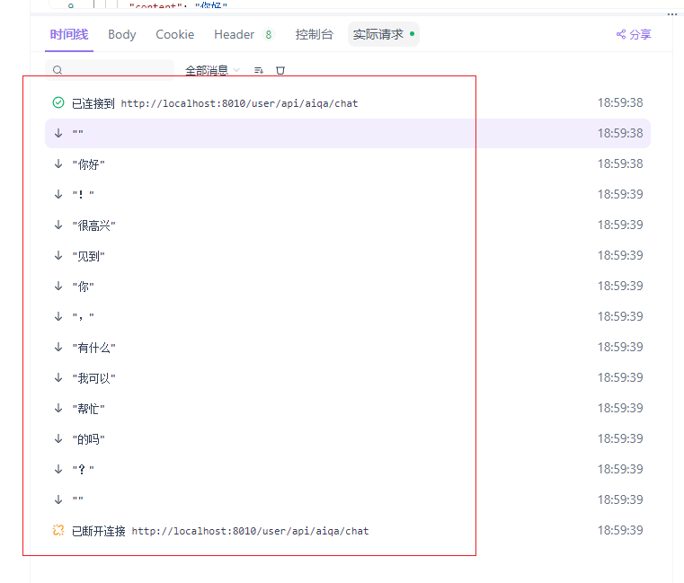

# AI-Demo

# 这是一个模版

这是我基于苍穹外卖项目浓缩出的一个框架为`SpringBoost2`+`Mybatis2` 的模版。

该模版具有苍穹外卖的各项基础功能，包括但不限于 拦截器+JWT，全局异常处理器，AOP等等。

该模版是用户端+管理员（员工端）。

我在这个模版的基础上，给用户端添加了AI相关功能

- 调用了DeepSeek提供的API，由此实现了AI问答功能。
- 待补充

# 调试过程

利用Knife4j框架结合Apifox，可以实现接口文档的自动更新和自动化测试，效果如下：

## 接口文档自动更新

## 自动化测试：

